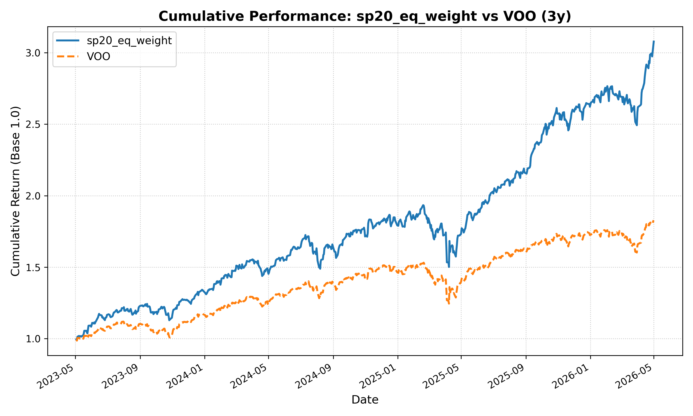

# Market Analysis CLI
---
> **✨ Vibe coded with Gemini-CLI, yet extensively tested ✨**
---

---

A suite of lightweight Python CLI tools designed to perform **market analysis**, **evaluate stock portfolio strategies**, and **construct market-cap weighted portfolios** normalized to Euros.

The project consists of two main tools:
1. **Performance Evaluator (`mkt-anlys-cli.py`)**: Define a personal financial index and evaluate its historical performance against benchmarks.
2. **Portfolio Constructor (`portfolio-cli.py`)**: Generate a market-cap weighted allocation (S&P 500 style) for a list of tickers.

### Unified EUR Perspective
Both tools normalize ALL financial data to **EUR**. This means if you have a portfolio with Apple (USD), Samsung (KRW), and Toyota (JPY), the tools will automatically:
- Fetch historical exchange rates for every day in the analysis period.
- Convert all prices, dividends, and market caps to Euros.
- Provide a consistent view of returns and allocations from an Euro-based investor's perspective.

---

## Project Structure (Detailed)

```
mkt-anlys-cli/
├── mkt-anlys-cli.py           # CLI entrypoint for backtesting and performance evaluation.
├── portfolio-cli.py           # CLI entrypoint for constructing market-cap weighted portfolios.
├── compute_idxs.sh            # Orchestration script running multiple performance backtests.
├── configs/                   # Portfolio configurations and ticker list inputs.
│   ├── ftse_all_wrld_20_eq_weight.json   # 20 FTSE All-World stocks (equal-weighted, 5% each)
│   ├── ftse_all_wrld_20_list.json        # 20 FTSE All-World stock tickers (array format)
│   ├── ibkr_portfolio.json               # IBKR portfolio (equal-weighted, 3.33% each)
│   ├── ibkr_portfolio+bnd.json           # IBKR portfolio with 50% SHY bonds
│   ├── ibkr_portfolio_list.json          # IBKR portfolio stock tickers (array format)
│   ├── ibkr_portfolio_mkt_cap.json       # IBKR portfolio stocks (market-cap weighted)
│   ├── sp20_eq_weight.json               # S&P 20 stocks (equal-weighted, 5% each)
│   ├── sp20_mkt_cap.json                 # S&P 20 stocks (market-cap weighted)
│   └── sp20_list.json                    # S&P 20 stock tickers (array format)
├── service/                   # Core business logic of the application.
│   ├── main_service.py        # Runs and orchestrates the index backtesting flow.
│   ├── plotting_service.py    # Generates high-resolution performance comparison plots.
│   ├── portfolio_service.py   # Computes EUR-normalized market cap allocations.
│   ├── reporting_service.py   # Computes cumulative returns, volatility, yield, and correlations.
│   └── yfinance_service.py    # Handles yfinance requests, rate queries, and caching.
├── tests/                     # Project test suite.
│   └── test_reporting.py      # Unit tests for financial reporting and metrics.
├── yfinance_cache/            # Local Parquet/JSON cache for market data and FX rates.
├── results/                   # Backtest output artifacts (plots, performance CSV reports).
└── portfolio_res/             # Constructed portfolio output CSV files.
```

---

## Installation

Requires [uv](https://github.com/astral-sh/uv):

```bash
# Sync dependencies
uv sync
```

---

## 1. Performance Evaluator (`mkt-anlys-cli.py`)
Evaluate your stock portfolio strategy against historical data.

### Usage Example
```bash
uv run mkt-anlys-cli.py \
  --weights '{"AAPL": 0.4, "005930.KS": 0.4, "SAP.DE": 0.2}' \
  --benchmark '^GSPC' \
  --outdir "./results" \
  --period "1y, 5y" \
  --idx_name "global_portfolio"
```

### Inputs
- `weights`: JSON dictionary mapping ticker to weight (0 to 1). Supports global tickers (e.g., `005930.KS` for Samsung).
- `benchmark`: Reference ticker (e.g., `^GSPC`).
- `outdir`: Target directory for charts and stats.
- `period`: Timeframe(s) (e.g., `1y, 5y`). Supported: `3mo, 6mo, 1y, 2y, 5y, 10y`.
- `idx_name`: Name for your index (no spaces).

### Orchestration Script (`compute_idxs.sh`)
You can execute preconfigured backtest simulations for multiple portfolios at once using:
```bash
./compute_idxs.sh
```

---

## 2. Portfolio Constructor (`portfolio-cli.py`)
Compute market-cap weighted allocations for a list of stocks to determine how much of each to buy given a total cash amount in Euros.

### Usage Example
```bash
uv run portfolio-cli.py \
  --input configs/ibkr_portfolio_list.json \
  --amount 3000 \
  --outfile portfolio_res/ibkr_allocation_3k.csv
```

### Inputs
- `input`: Path to a JSON file containing a list of global yfinance tickers.
- `amount`: Total amount in **Euros** you are willing to invest.
- `outfile`: Path to the generated CSV allocation report.

### Pre-defined Ticker Lists
- **IBKR Stocks**: `configs/ibkr_portfolio_list.json`
- **S&P 20 (SP20) Stocks**: `configs/sp20_list.json`
- **FTSE All-World 20 Stocks**: `configs/ftse_all_wrld_20_list.json`

---

## Performance & Caching
- **Local Cache:** Raw market data and ticker metadata are cached in `./yfinance_cache/` using Parquet and JSON formats to avoid redundant network requests.
- **Exchange Rate Caching:** Currency conversion rates are fetched once per day and cached locally.

---

## Outputs & Interpretation

### Performance Analysis (mkt-anlys-cli.py)
Generates high-resolution PNG charts and a `{idx_name}_summary.csv` file. All metrics (Return, Volatility, Yield) are calculated **after currency conversion to EUR**.

### Portfolio Allocation (portfolio-cli.py)
Generates a CSV with the following columns:
- **Ticker**: The stock symbol.
- **Euros to Allocate**: How much to spend in EUR.
- **Dollars to Allocate**: Equivalent value in USD.
- **Percentage**: The stock's weight in the total portfolio (calculated based on EUR-normalized market caps).

---

## Logging & Troubleshooting
The tools utilize verbose, high-signal logging to help you track data fetching, currency normalization, cache hits/misses, and calculation steps.

Example:
```
2026-05-10 07:30:31.858 INFO [main_service.py:35] normalize_data_to_eur: Normalizing 'AAPL' from USD to EUR...
```
