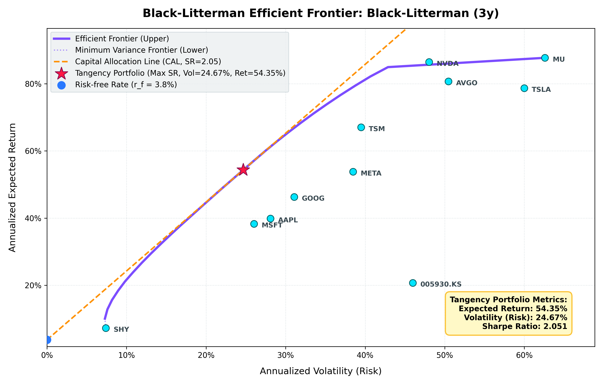

# Market Analysis & Portfolio Optimization Toolset
---

---

A Python-based suite of command-line utilities for financial backtesting, asset allocation, and Black-Litterman portfolio optimization, parameterized with daily currency normalization to Euros (EUR).

The toolkit comprises:
1. **Performance Backtester (`mkt-anlys-cli.py`)**: Evaluates custom multi-asset index strategies against a specified benchmark.
2. **Capitalization Allocator (`portfolio-cli.py`)**: Calculates market-cap-weighted allocations for a given ticker list.
3. **Black-Litterman Optimizer (`bl-ef-optim.py`)**: Solves for optimal long-only Sharpe ratio portfolios using Black-Litterman prior estimations and derives the constrained efficient frontier coordinates.

---

## Repository Structure

```
mkt-anlys-cli/
├── mkt-anlys-cli.py           # CLI for backtesting and performance evaluation.
├── portfolio-cli.py           # CLI for constructing market-cap weighted portfolios.
├── bl-ef-optim.py             # CLI for Black-Litterman & Efficient Frontier optimization.
├── compute_idxs.sh            # Automation script to execute a batch of backtests.
├── configs/                   # Portfolio configurations and input ticker arrays.
│   ├── ftse_all_wrld_20_eq_weight.json   # 20 FTSE All-World stocks (equal-weighted)
│   ├── ftse_all_wrld_20_list.json        # Ticker list for FTSE All-World selection
│   ├── ibkr_portfolio.json               # IBKR portfolio (equal-weighted)
│   ├── ibkr_portfolio+bnd.json           # IBKR portfolio balanced with 50% SHY
│   ├── ibkr_portfolio_list.json          # IBKR portfolio ticker array
│   ├── ibkr_portfolio_mkt_cap.json       # IBKR portfolio (market-cap weighted)
│   ├── sp20_eq_weight.json               # S&P 20 selection (equal-weighted)
│   ├── sp20_mkt_cap.json                 # S&P 20 selection (market-cap weighted)
│   └── sp20_list.json                    # S&P 20 ticker array
├── service/                   # Core mathematical and data services.
│   ├── main_service.py        # Pipeline orchestrator for index backtesting.
│   ├── capm_service.py        # CAPM statistics computation and currency normalization.
│   ├── bl_optim_service.py    # Black-Litterman modeling and quadratic optimization.
│   ├── plotting_service.py    # Matplotlib-based visualizations (Performance, EF, SML).
│   ├── portfolio_service.py   # Portfolio weight and allocation calculators.
│   ├── reporting_service.py   # Statistical reporting (CAGR, volatility, yield, correlation).
│   └── yfinance_service.py    # yfinance client interface with local Parquet-based caching.
├── tests/                     # Unit and integration test suite.
├── yfinance_cache/            # Local directory caching raw price and FX rates.
├── results/                   # Backtest artifacts, reports, and generated plots.
└── portfolio_res/             # Exported portfolio allocation files (CSV).
```

---

## Installation

The project uses [uv](https://github.com/astral-sh/uv) for dependency management and environment isolation.

```bash
# Sync virtual environment and dependencies
uv sync
```

---

## Tool Specifications and Usage

### 1. Performance Backtester (`mkt-anlys-cli.py`)
Computes the historical performance of a custom-weighted asset index relative to a benchmark index. Foreign-denominated close prices and dividend distributions are normalized daily to EUR using historical FX rates to isolate currency effects from organic performance.

#### Usage:
```bash
uv run mkt-anlys-cli.py \
  --weights '{"AAPL": 0.4, "005930.KS": 0.4, "SAP.DE": 0.2}' \
  --benchmark '^GSPC' \
  --outdir "./results" \
  --period "1y, 5y" \
  --idx_name "global_portfolio"
```

#### Parameters:
* `--weights` *(JSON string)*: Dictionary mapping stock tickers to target portfolio weights (must sum to 1.0). Supports global exchange suffixes (e.g., `.KS`, `.DE`).
* `--benchmark` *(string)*: Ticker of the reference benchmark index (default: `^GSPC`).
* `--outdir` *(Path)*: Output directory path for charts and spreadsheets.
* `--period` *(string)*: Comma-separated lookback intervals. Supported values: `3mo, 6mo, 1y, 2y, 5y, 10y`.
* `--idx_name` *(string)*: Identifier prefix used for file naming.

#### Outputs:
* `{idx_name}_{period}.png`: Plot of cumulative index returns vs. benchmark.
* `{idx_name}_summary.csv`: Table containing annualized return (CAGR), annualized volatility, dividend yield, and benchmark correlation.

---

### 2. Capitalization Allocator (`portfolio-cli.py`)
Calculates target currency allocations based on the free-float market capitalizations of a given set of tickers. Denominated currencies are converted to EUR at current spot rates to form a standard capital-weighted distribution.

#### Usage:
```bash
uv run portfolio-cli.py \
  --input configs/ibkr_portfolio_list.json \
  --amount 10000 \
  --outfile portfolio_res/ibkr_allocation_10k.csv
```

#### Parameters:
* `--input` *(Path)*: Path to a JSON array containing stock tickers.
* `--amount` *(float)*: Total investment capital in EUR.
* `--outfile` *(Path)*: Destination path for the allocation report.

#### Output format:
```csv
Ticker,Euros to Allocate,Dollars to Allocate,Percentage
AAPL,2358.75,2686.50,16.85
MSFT,1413.44,1609.84,10.10
...
```

---

### 3. Black-Litterman Optimizer (`bl-ef-optim.py`)
Runs a Black-Litterman portfolio optimization under equilibrium conditions (zero-views state), computes CAPM metrics (Alpha, Beta), and plots the constrained Markowitz Efficient Frontier and Security Market Line (SML).

#### Usage:
```bash
uv run bl-ef-optim.py \
  --tickers configs/sp20_list.json \
  --horizon "2mo" \
  --risk-free "^IRX" \
  --benchmark "VT" \
  --period "3y" \
  --usd-buy 14000 \
  --outdir "./results/optimal_portfolio"
```

#### Parameters:
* `--tickers` *(Path)*: Path to a JSON array containing stock tickers to optimize.
* `--horizon` *(string)*: Investment horizon used to scale returns and covariances (e.g., `2mo` -> 42 trading days, or directly as an integer number of days). (Default: `2mo`).
* `--risk-free` *(string)*: Annualized risk-free rate, specified either as a numeric decimal (e.g., `0.035`) or as a yfinance ticker (e.g., `^IRX` for Treasury Bills). (Default: `0.04`).
* `--benchmark` *(string)*: Reference benchmark used to compute risk aversion and CAPM regressions (default: `VT`).
* `--period` *(string)*: Lookback period for covariance matrix estimation (default: `2y`). Supported: `3mo, 6mo, 1y, 2y, 5y, 10y`.
* `--usd-buy` *(float)*: Total cash allocation in USD to distribute according to optimal weights.
* `--outdir` *(Path)*: Output path for the data and charts.

---

## Computational Methodology

### 1. USD Currency Normalization
All inputs are daily-adjusted for currency conversion:
This isolates organic asset returns from exchange rate fluctuations during historical lookbacks.

### 2. Horizon Parameter Scaling
The covariance matrix ($\Sigma$) and risk-free rate ($r_f$) are scaled to match the investment horizon $H$ (in trading days):
$$\Sigma_{horizon} = \Sigma_{daily} \times H$$
$$r_{f, horizon} = r_{f, annual} \times \left( \frac{H}{360} \right)$$

To maintain standard reporting conventions, final outputs are mapped back to an annualized basis:
$$\text{Scaling Factor}_{return} = \frac{360.0}{H}$$
$$\text{Scaling Factor}_{volatility} = \sqrt{\frac{252.0}{H}}$$

### 3. Parameter Estimations
* **Prior Uncertainty ($\tau$):** Calculated dynamically to account for sample size:
  $$\tau = \frac{1}{T}$$
  where $T$ represents the number of daily historical observations.
* **Risk Aversion ($\lambda$):** Inferred dynamically from benchmark excess returns:
  $$\lambda = \max\left(0.1, \frac{R_{benchmark}^{ann} - r_f}{\sigma_{benchmark}^2}\right)$$

### 4. Quadratic Optimization Model
The optimal tangency weights and efficient frontier coordinates are computed under long-only constraints (no short selling) using Sequential Least-Squares Programming (SLSQP):
$$\min_{w} \quad \frac{1}{2} w^T \Sigma_{BL} w \quad \text{s.t.} \quad w^T \mathbf{1} = 1, \ w^T \mu_{BL} = \mu_p, \ w \ge 0$$

---

## Output Deliverables

The Black-Litterman optimization run produces the following artifacts:
1. **Efficient Frontier Plot (`*efficient_frontier.png`)**: Visualizes the long-only minimum variance frontier, Capital Allocation Line (CAL), asset coordinates, and the optimal Tangency portfolio.
2. **Security Market Line Plot (`*sml.png`)**: Charts annualized expected returns against systematic risk ($\beta$), showing individual asset alphas.
3. **`bl_optimization_results.json`**: Complete raw output containing prior parameters, posterior covariance, and frontier coordinates.
4. **`tangency_portfolio_only.json`**: Summary of weights, expected return, volatility, Sharpe ratio, and buy allocations if `--usd-buy` is specified.
5. **`capm_alpha_beta.json`**: Individual asset and portfolio Alpha and Beta values relative to the selected benchmark.

---

## Testing & Quality Control

### Unit and Integration Tests (Pytest)
```bash
# Run entire test suite
uv run pytest

# Execute unit-level logic tests only
uv run pytest -m unit

# Run tests with coverage reports
uv run pytest --cov=service --cov=mkt-anlys-cli --cov=portfolio-cli
```

### Static Analysis
```bash
# Style compliance and import sorting checks
uv run ruff check .

# Apply auto-fixable rules
uv run ruff check . --fix

# Static type verification
uv run mypy .
```
